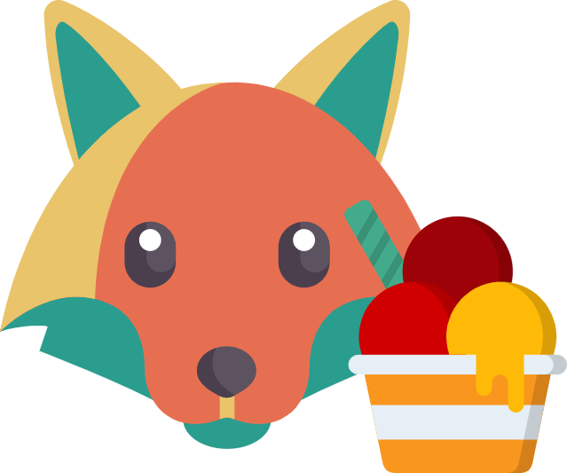

# fox machine 📠



> Have you ever wanted to convert any single word into a *semi* unique, colorful image of a cute fox enjoying ice cream? Well now you can finally sleep well at night knowing a solution exists.

[View Demo](https://dlaible.github.io/fox-machine/)

## Instructions

```
npm install  # install dependencies
npm run dev  # start dev server (with HMR support)
npm run build:prod  # build static app assets (production)
```

## Technologies Used

- React
- TypeScript
- vite
